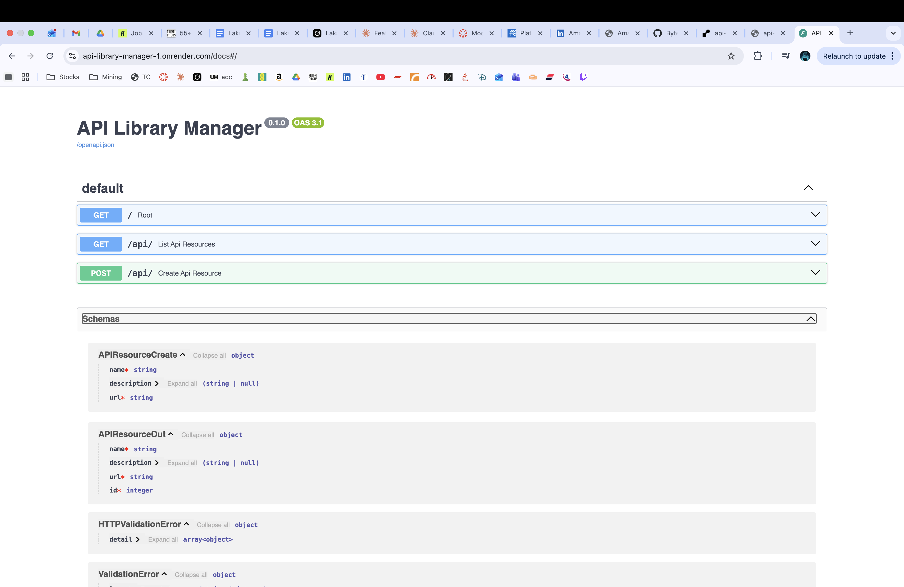

# 📚 API Library Manager

A **REST API** for cataloguing and managing API resources — built with **FastAPI** and **SQLite**. Full CRUD, search, pagination, and auto-generated interactive docs.


## 🚀 Live Demo

> 🔗 **[API on Render](https://api-library-manager-1.onrender.com)** · **[Interactive Docs](https://api-library-manager-1.onrender.com/docs)**
>
> ⚠️ Free tier — may take 30–60 seconds to wake up on first request.

## 📸 Screenshots



## ✨ Features

- **Full CRUD** — Create, Read, Update, Delete API resources
- **Search** — filter by name, description, or URL (case-insensitive)
- **Pagination** — `skip` & `limit` query params
- **Auto docs** — Swagger UI at `/docs`, ReDoc at `/redoc`
- **Input validation** — Pydantic v2 models, duplicate URL detection
- **Zero-config DB** — SQLite, no external database server needed

## 🛠️ Tech Stack

| Technology | Purpose |
|-----------|---------|
| Python 3.10+ | Core language |
| FastAPI | Web framework |
| SQLAlchemy | ORM / database layer |
| SQLite | Embedded database |
| Pydantic v2 | Request/response validation |
| Uvicorn | ASGI server |
| Render | Cloud deployment |

## 📦 Getting Started

```bash
# Clone the repo
git clone https://github.com/ByteMe-UK/api-library-manager.git
cd api-library-manager

# Create virtual environment
python3 -m venv venv
source venv/bin/activate  # Windows: venv\Scripts\activate

# Install dependencies
pip install -r requirements.txt

# Run the API
uvicorn app.main:app --reload
```

Open `http://localhost:8000/docs` for the interactive Swagger UI.

## 📡 API Endpoints

| Method | Endpoint | Description |
|--------|----------|-------------|
| `GET` | `/` | Welcome + endpoint index |
| `GET` | `/api/` | List all resources (supports search + pagination) |
| `POST` | `/api/` | Create a new resource |
| `GET` | `/api/{id}` | Get a resource by ID |
| `PUT` | `/api/{id}` | Update a resource (partial update supported) |
| `DELETE` | `/api/{id}` | Delete a resource |

### Query Parameters (GET `/api/`)

| Param | Type | Default | Description |
|-------|------|---------|-------------|
| `search` | string | — | Filter by name, description, or URL |
| `skip` | int | 0 | Records to skip (pagination offset) |
| `limit` | int | 20 | Max records returned (capped at 100) |

### Example Requests

```bash
# Create a resource
curl -X POST http://localhost:8000/api/ \
  -H "Content-Type: application/json" \
  -d '{"name": "OpenWeather API", "description": "Free weather data", "url": "https://api.openweathermap.org"}'

# List all
curl http://localhost:8000/api/

# Search
curl "http://localhost:8000/api/?search=weather"

# Paginate
curl "http://localhost:8000/api/?skip=0&limit=5"

# Update
curl -X PUT http://localhost:8000/api/1 \
  -H "Content-Type: application/json" \
  -d '{"description": "Updated description"}'

# Delete
curl -X DELETE http://localhost:8000/api/1
```

### Example Response

```json
{
  "id": 1,
  "name": "OpenWeather API",
  "description": "Free weather data",
  "url": "https://api.openweathermap.org"
}
```

## 📁 Project Structure

```
api-library-manager/
├── app/
│   ├── main.py        ← FastAPI app, all endpoints
│   ├── database.py    ← SQLAlchemy engine, session, APIResource model
│   ├── schemas.py     ← Pydantic v2 request/response schemas
│   └── models.py      ← (reserved for future model expansion)
├── Procfile           ← Render deployment config
├── requirements.txt   ← Python dependencies
├── LICENSE
└── README.md
```

## 🚢 Deployment (Render)

1. Push this repo to GitHub
2. Go to [render.com](https://render.com) → **New Web Service**
3. Connect your GitHub repo
4. Set **Start Command**: `uvicorn app.main:app --host 0.0.0.0 --port $PORT`
5. Click **Deploy**

The `Procfile` already has the correct start command.

## 📄 License

MIT License — see [LICENSE](LICENSE) for details.

---

**Part of the [ByteMe-UK](https://github.com/ByteMe-UK) portfolio collection.**


hello